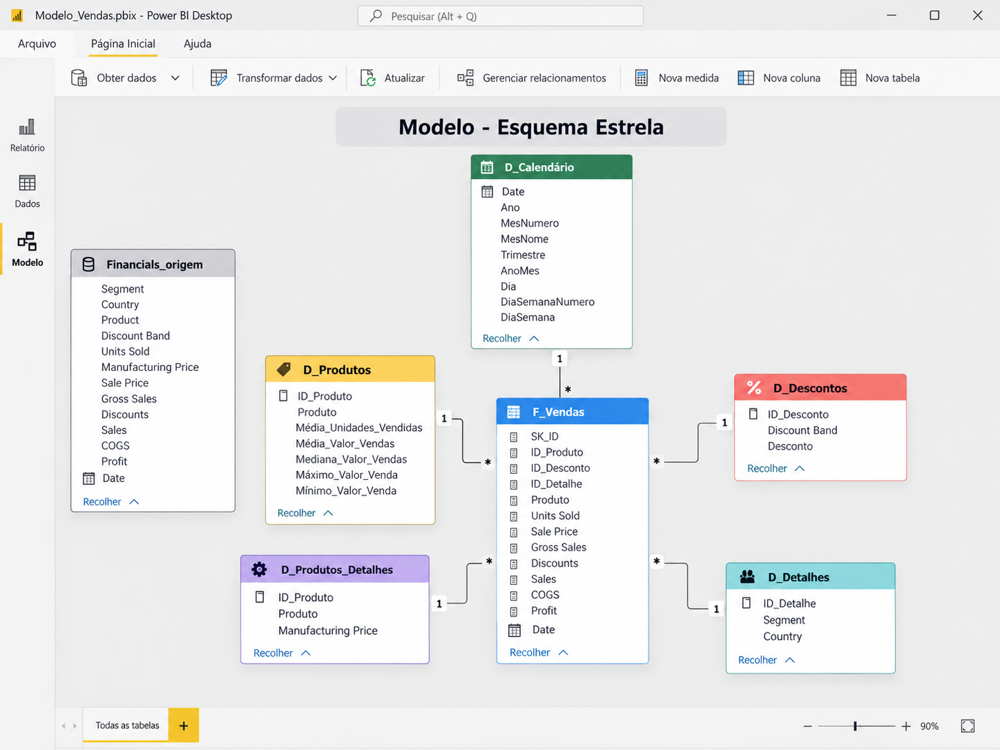
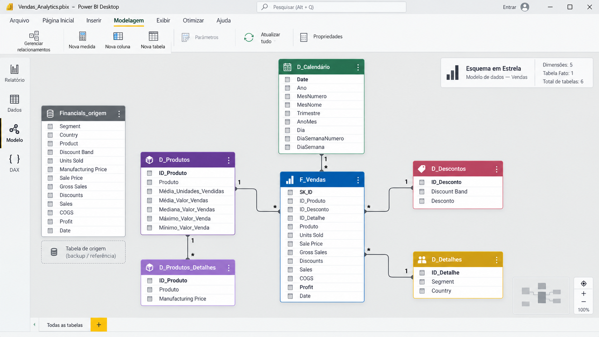

# 📊 Criando um Star Schema para Cenários de Vendas com Power BI

## Projeto prático — DIO

**Autora:** Viviane Rambor  
**Tecnologia principal:** Microsoft Power BI  
**Tema:** Modelagem dimensional — Star Schema  
**Nível:** Intermediário  

---

## Sobre o projeto

Este projeto foi desenvolvido como parte de um desafio prático da DIO com foco em **modelagem dimensional no Power BI**.

A proposta consiste em partir de uma base de vendas em formato tabular e reorganizar os dados em um **modelo estrela**, separando as informações em uma tabela fato central e tabelas dimensão.

Mais do que cumprir uma atividade técnica, a intenção foi construir um modelo simples de entender, organizado e preparado para análises futuras.

---

## Objetivo

Transformar a base de vendas em uma estrutura dimensional capaz de facilitar:

- análise de vendas;
- comparação de desempenho por produto;
- análise por país e segmento;
- avaliação de descontos;
- acompanhamento de lucro e faturamento;
- análises por período;
- criação de medidas DAX;
- desenvolvimento de dashboards no Power BI.

---

## Estrutura do modelo

A tabela central do projeto é a **F_Vendas**.

Ao redor dela estão as dimensões:

- **D_Produtos**
- **D_Produtos_Detalhes**
- **D_Descontos**
- **D_Detalhes**
- **D_Calendário**

A tabela **Financials_origem** foi mantida como referência da base original utilizada no processo de transformação.

---

## Visão do modelo



Também foi criada uma versão em formato horizontal:



> As imagens acima representam visualmente a estrutura proposta para o projeto.  
> Para a entrega final, recomenda-se também incluir uma captura real da tela **Modelo** do Power BI após a construção do arquivo `.pbix`.

---


### Observação sobre a base incluída

O repositório contém o arquivo `data/Financial Sample.xlsx`, criado como uma **base educacional compatível** com a estrutura utilizada no desafio. Ele possui 700 registros e os mesmos campos necessários para construir o modelo dimensional proposto.

Para uma entrega que exija exatamente a pasta de trabalho oficial da Microsoft, basta substituir esse arquivo pela versão original disponibilizada na documentação do Power BI. A referência está registrada em `data/FONTE_DADOS.md`.

## Tabela fato — F_Vendas

A tabela `F_Vendas` concentra os registros transacionais.

### Campos principais

| Campo | Descrição |
|---|---|
| SK_ID | Identificador único da transação |
| ID_Produto | Chave de relacionamento com produto |
| ID_Desconto | Chave de relacionamento com desconto |
| ID_Detalhe | Chave de relacionamento com segmento e país |
| Produto | Produto vendido |
| Units Sold | Quantidade vendida |
| Sale Price | Preço de venda |
| Gross Sales | Venda bruta |
| Discounts | Valor do desconto |
| Sales | Venda líquida |
| COGS | Custo |
| Profit | Lucro |
| Date | Data da operação |

---

## Dimensão — D_Produtos

A dimensão `D_Produtos` reúne informações consolidadas de desempenho dos produtos.

| Campo | Descrição |
|---|---|
| ID_Produto | Identificador do produto |
| Produto | Nome do produto |
| Média_Unidades_Vendidas | Média das unidades vendidas |
| Média_Valor_Vendas | Média do valor de vendas |
| Mediana_Valor_Vendas | Mediana do valor de vendas |
| Máximo_Valor_Venda | Maior valor de venda |
| Mínimo_Valor_Venda | Menor valor de venda |

---

## Dimensão — D_Produtos_Detalhes

Complementa as informações dos produtos.

| Campo | Descrição |
|---|---|
| ID_Produto | Identificador do produto |
| Produto | Nome do produto |
| Manufacturing Price | Preço de fabricação |

---

## Dimensão — D_Descontos

Organiza as informações relacionadas às faixas de desconto.

| Campo | Descrição |
|---|---|
| ID_Desconto | Identificador da faixa de desconto |
| Discount Band | Faixa de desconto |
| Desconto | Informação do desconto |

---

## Dimensão — D_Detalhes

Concentra informações contextuais da venda.

| Campo | Descrição |
|---|---|
| ID_Detalhe | Identificador |
| Segment | Segmento de mercado |
| Country | País |

---

## Dimensão — D_Calendário

A dimensão calendário foi criada em DAX para permitir análises temporais consistentes.

Campos utilizados:

- Date
- Ano
- MesNumero
- MesNome
- Trimestre
- AnoMes
- Dia
- DiaSemanaNumero
- DiaSemana

---

## Relacionamentos

O modelo foi estruturado priorizando relacionamentos **1:N**, com as dimensões no lado `1` e a tabela fato no lado `N`.

| Dimensão | Tabela fato | Cardinalidade |
|---|---|---|
| D_Produtos[ID_Produto] | F_Vendas[ID_Produto] | 1:N |
| D_Descontos[ID_Desconto] | F_Vendas[ID_Desconto] | 1:N |
| D_Detalhes[ID_Detalhe] | F_Vendas[ID_Detalhe] | 1:N |
| D_Calendário[Date] | F_Vendas[Date] | 1:N |

O relacionamento envolvendo `D_Produtos_Detalhes` deve ser validado no Power BI conforme a forma como a dimensão for construída, evitando duplicidade de chave e relacionamentos muitos-para-muitos desnecessários.

---

## Medidas DAX

### Total de Vendas

```DAX
Total Vendas =
SUM(F_Vendas[Sales])
```

### Vendas Brutas

```DAX
Vendas Brutas =
SUM(F_Vendas[Gross Sales])
```

### Total de Lucro

```DAX
Total Lucro =
SUM(F_Vendas[Profit])
```

### Unidades Vendidas

```DAX
Unidades Vendidas =
SUM(F_Vendas[Units Sold])
```

### Total de Descontos

```DAX
Total Descontos =
SUM(F_Vendas[Discounts])
```

### Margem de Lucro

```DAX
Margem Lucro % =
DIVIDE(
    [Total Lucro],
    [Total Vendas],
    0
)
```

### Ticket Médio

```DAX
Ticket Médio =
DIVIDE(
    [Total Vendas],
    COUNTROWS(F_Vendas),
    0
)
```

---

## DAX da tabela calendário

```DAX
D_Calendário =
VAR DataMinima =
    MINX(F_Vendas, F_Vendas[Date])

VAR DataMaxima =
    MAXX(F_Vendas, F_Vendas[Date])

RETURN
ADDCOLUMNS(
    CALENDAR(DataMinima, DataMaxima),
    "Ano", YEAR([Date]),
    "MesNumero", MONTH([Date]),
    "MesNome", FORMAT([Date], "MMMM"),
    "Trimestre", "T" & QUARTER([Date]),
    "AnoMes", FORMAT([Date], "YYYY-MM"),
    "Dia", DAY([Date]),
    "DiaSemanaNumero", WEEKDAY([Date], 2),
    "DiaSemana", FORMAT([Date], "dddd")
)
```

---

## Etapas desenvolvidas

O projeto foi estruturado a partir das seguintes etapas:

1. importação da base de vendas;
2. criação de uma consulta de origem;
3. criação das dimensões;
4. criação da tabela fato;
5. tratamento de dados no Power Query;
6. eliminação de duplicidades;
7. criação de identificadores;
8. criação da tabela calendário;
9. configuração dos relacionamentos;
10. criação de medidas DAX;
11. validação do modelo;
12. organização visual da tela de modelo;
13. preparação do projeto para publicação no GitHub.

---

## O que aprendi com o projeto

A principal percepção durante o desenvolvimento foi que uma boa análise começa antes do dashboard.

Quando os dados são organizados de forma clara, com responsabilidades bem definidas entre tabelas fato e dimensões, o restante do trabalho se torna mais simples: os relacionamentos ficam mais previsíveis, as medidas DAX ficam mais fáceis de construir e a leitura do modelo melhora bastante.

O exercício também reforçou a importância de pensar na qualidade da modelagem, e não apenas no resultado visual final.

---

## Estrutura do repositório

```text
dio-star-schema-power-bi-viviane-rambor/
│
├── README.md
│
├── images/
│   ├── modelo-star-schema.png
│   └── modelo-star-schema-wide.png
│
├── docs/
│   ├── dax-medidas.md
│   ├── passo-a-passo-power-bi.md
│   ├── modelo-de-dados.md
│   └── texto-entrega-dio.md
│
├── powerbi/
│   └── ADICIONE_AQUI_SEU_ARQUIVO_PBIX.txt
│
└── data/
    └── ADICIONE_AQUI_A_BASE_UTILIZADA.txt
```

---

## Tecnologias e conceitos utilizados

- Microsoft Power BI
- Power Query
- DAX
- Modelagem dimensional
- Star Schema
- ETL
- Tabela fato
- Tabelas dimensão
- Cardinalidade
- Relacionamentos 1:N
- Git
- GitHub

---

## Conclusão

Este projeto permitiu aplicar, de forma prática, conceitos fundamentais de modelagem de dados no Power BI.

A transformação de uma base única em um modelo dimensional tornou a estrutura mais organizada e preparada para análises de negócio, além de oferecer uma base mais adequada para a criação de relatórios e dashboards.

O resultado final representa não apenas a conclusão de um desafio da DIO, mas também mais um projeto para meu portfólio de estudos em dados e Business Intelligence.

---

## Autora

**Viviane Rambor**

Projeto desenvolvido para fins educacionais e composição de portfólio profissional.
